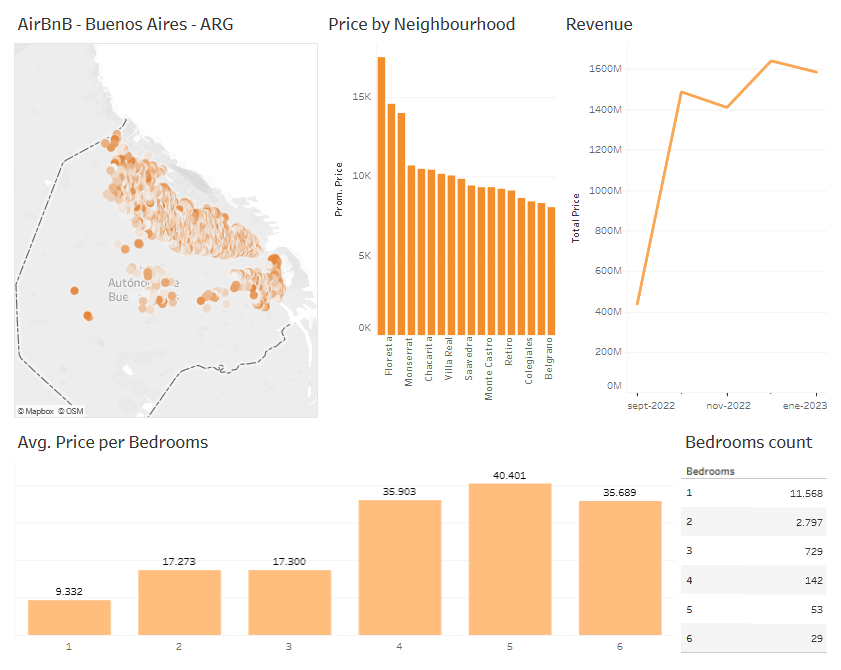

# Buenos Aires AirBnB

Dashboard with AirBnB data from Buenos Aires Argentina.  

[LINK: Interactive Tableau Dashboard](https://public.tableau.com/app/profile/melisa.di.giacomo/viz/AirBnB-BuenosAires-ARG/AirBnB_Dashboard)

  

I analyzed the prices of the different neighbourhoods, months and number of bedrooms. I also counted the number of AirBnBs with one to six bedrooms to analyze the number of competitors a new AirBnB would have.  

Dataset from: http://insideairbnb.com/get-the-data/