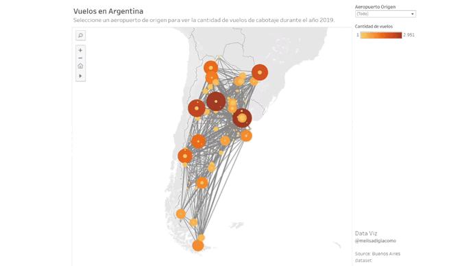
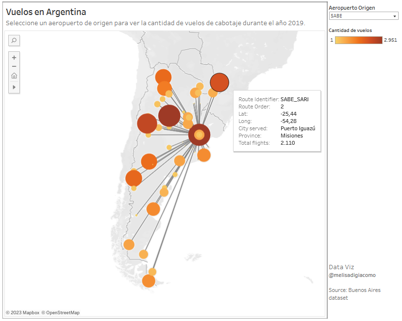

# Domestic Flights in Argentina

This interactive dashboard shows the airports of Argentina with their connections and number of flights.

[LINK: Interactive Tableau Dashboard](https://public.tableau.com/app/profile/melisa.di.giacomo/viz/VuelosCabotajeArgentina2019/Dashboard1)

  

You can select an airport of origin to see the number of domestic flights during 2019. For example, SABE (Aeroparque - Buenos Aires) is the airport with the highest number of flights.

 