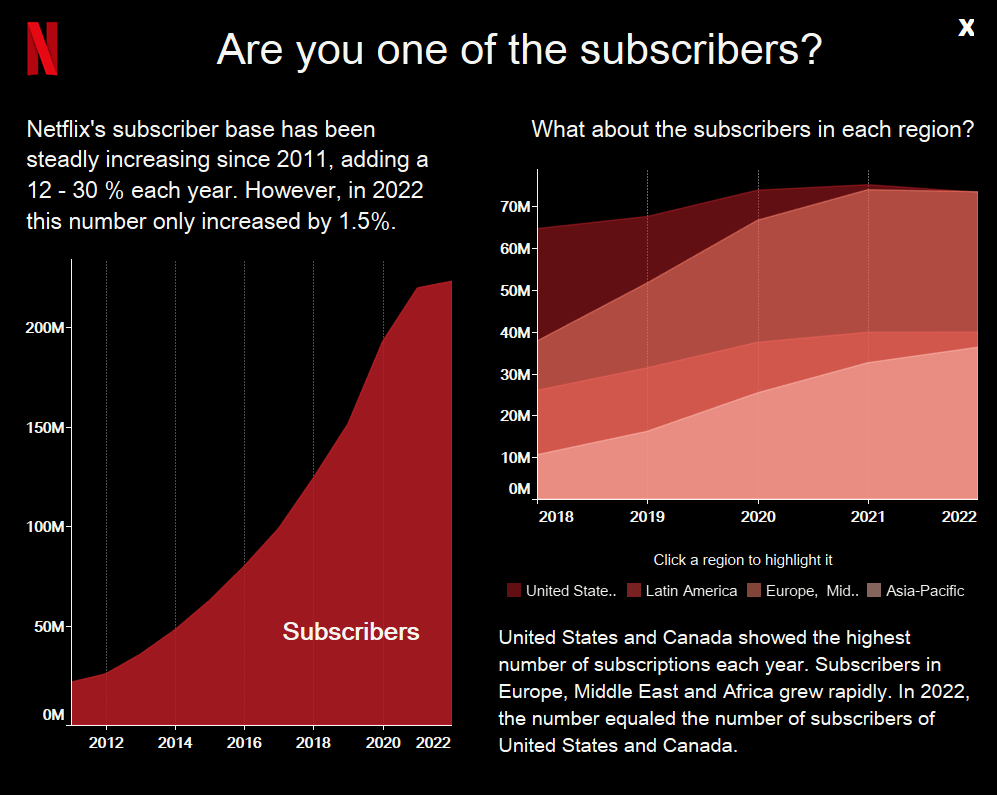

# Netflix Data Analysis

  

This repo contains the process of a data analysis I made with Netflix data and the final data visualization on a Tableau dashboard.

[LINK: Interactive Tableau Dashboard](https://public.tableau.com/app/profile/melisa.di.giacomo/viz/Netflix_DataAnalysis_16742448163570/Home_dashboard)

## Thinking process

First, I did a brainstorming. I searched available Netflix data, studied the aesthetics of Netflix screens and choose the color palette.

  

I want to answer some questions with the datasets. I separete into three dashboards:

1) **Content**
- Top 5 countries and their total content type
- Top 10 genres
- Number of movies and TV shows per age

2) **Timeline**
- Number of content added by year
- Total movies and TV shows by year

3) **Subscribers**
- Timeline of subscribers
- Subscribers by regions and year

## Searching and cleaning up the data

I dowloaded Netflix titles data. I cleaned the dataset coding in Python. I seperate two datasets based on the questions I need to answer in the final visualization. Briefly, I dropped some cols, extracted year added, rated the ages into kids, teens and adults and kept the principal genre of each title. Furthermore, I splitted countries into different cells. I downloaded the two cleaned datasets. I also downloaded two other datasets with subscribers and revenues by year and subscribers by region to add more detail to the final visualization.

  

## Dashboard

- Homepage

I made a homepage that resembled the original application’s user interface. This page is known to the user so it is very intuitive and easy to understand without the need for instructions. It is the first approach to the dashboard and it invites the user to navigate in a netflix data analysis experience.

  

- **Content dashboard**

This dashboard is focused on Netflix’s content. I wanted to show the top 5 countries and their type content (Movies or TV shows). Another user interest could be type of content by age (adults, teens and kids). I also included the top 10 genres.

  

- **Timeline dashboard**

This dashboard have the purpose of showcasing the growth of Netflix over the years. First I showed the total number of TV shows and Movies added until 2021. Then an area chart was plotted to show the timeline with type color differentiation.

  

- **Subscribers dashboard**

The third dashboard is based on subscribers. The emphasis here is on displaying the increasing number of subscribers from 2011 to 2022. The number of subscribers by region was differentiated in an overlapped area chart. Each region could be highlighted by clicking on the menu below.

  